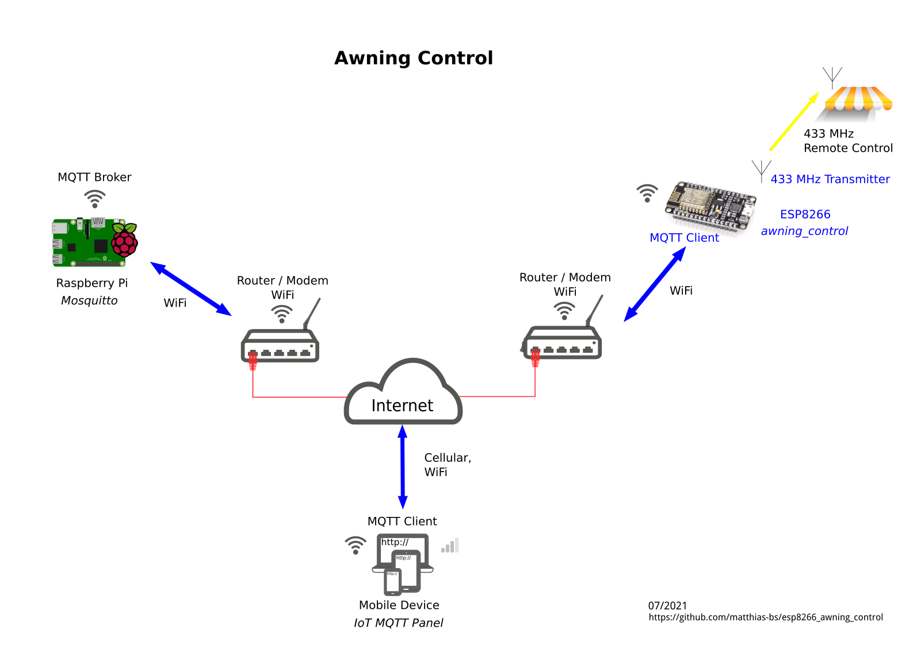

# esp8266_awning_control
## ESP8266 (secure) MQTT to ISM Band (e.g. 433 MHz) Awning Remote Control

(using Arduino IDE)

### System Setup
- The awning is normally controlled via a handheld 433 MHz (or other [ISM radio band](https://en.wikipedia.org/wiki/ISM_radio_band) depending on where you live) remote control
- The ESP8266 with [**awning_control**](src/awning_control.ino) sketch provides secure MQTT access via WiFi and converts MQTT messages into radio control sequences
- An MQTT client, such as a smart phone or tablet with [IoT MQTT Panel](https://snrlab.in/iot/iot-mqtt-panel-user-guide) app, can communicate with awning_control from a remote location
- An MQTT broker (such as a [Raspberry Pi](https://www.raspberrypi.org/) with [Mosquitto](https://mosquitto.org/)) passes control and status messages between the two clients

see figure below



### Dashboard with [IoT MQTT Panel](https://snrlab.in/iot/iot-mqtt-panel-user-guide)


**MQTT Interface**
```
MQTT subscriptions:
     <base_topic>/in           (-)
     <base_topic>/out          ([seconds])
     <base_topic>/stop         (-)

MQTT publications:
     <base_topic>/status       ("online"|"dead"$)
     <base_topic>/last_cmd     ('>' | ']' | '}' | ')' | '<' | '[')*

$ via LWT

*) Last Command Tokens
    > - moving out
    ] - moved  out
    } - moving partially out
    ) - moved  partially out
    < - moving in
    [ - moved  out
```
