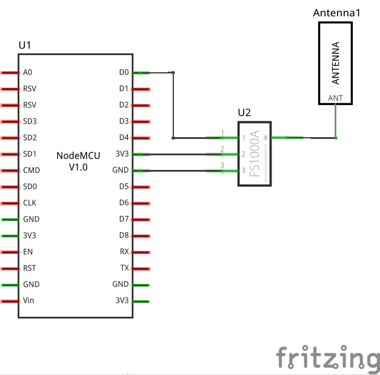
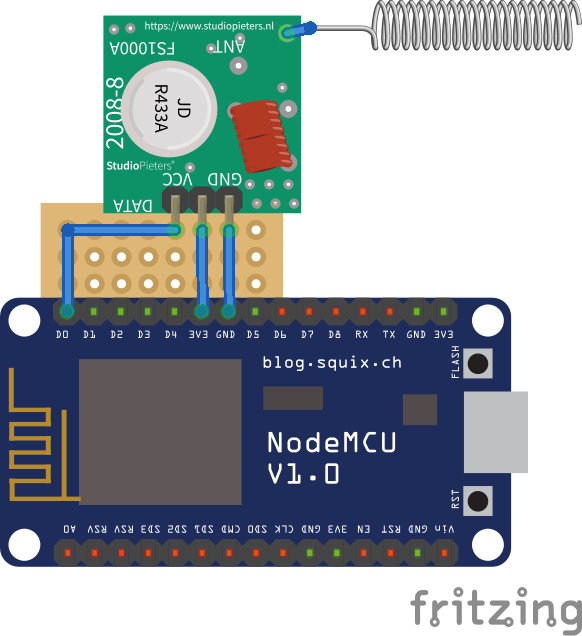

# esp8266_awning_control
## ESP8266 (secure) MQTT to ISM Radio Band Awning Remote Control

(using Arduino IDE)

### System Setup
- The awning is normally controlled via a handheld 433 MHz (or other [ISM radio band](https://en.wikipedia.org/wiki/ISM_radio_band) depending on where you live) remote control
- The ESP8266 NodeMCU with [**awning_control**](src/awning_control.ino) sketch provides secure MQTT access via WiFi and converts MQTT messages into radio control sequences sent by the FS1000A RF Transmitter
- An MQTT client, such as a smart phone or tablet with [IoT MQTT Panel](https://snrlab.in/iot/iot-mqtt-panel-user-guide) app, can communicate with awning_control from a remote location
- An MQTT broker (such as a [Raspberry Pi](https://www.raspberrypi.org/) with [Mosquitto](https://mosquitto.org/)) passes control and status messages between the two clients
- **Your awning specific radio remote control sequences must initially be received and recorded as described in [thexperiments /
esp8266_RFControl](https://github.com/thexperiments/esp8266_RFControl)!!!**

see figure below


Copyright Notice:

* https://www.123rf.com/photo_52895758_stock-vector-sign-yellow-awning.html 

   Copyright: [maudis60](https://www.123rf.com/profile_maudis60)

* https://commons.wikimedia.org/wiki/File:Nodemcu_amica_bot_02.png

   Copyright: [Make Magazin DE](https://commons.wikimedia.org/wiki/User:MakeMagazinDE) 

* all other images: 

   creative commons/public domain


### Hardware

**Schematic**




**ESP8266 NodeMCU, Breadboard, RF Transmitter Module and Antenna**




**Fritzing Parts**

<table>
<tr><td>NodeMCU-v1.0              <td>https://github.com/squix78/esp8266-fritzing-parts/blob/master/nodemcu-v1.0/NodeMCUV1.0.fzpz
<tr><td>FS1000A 433MHz Transmitter<td>https://github.com/AchimPieters/Fritzing-Custom-Parts/releases/tag/0.0.1
<tr><td>Antenna                   <td>https://forum.fritzing.org/t/hc-12-module-433mhz-long-range-1-8km/1976
</table>

    
**Power Supply**

The circuit is powered from the ESP8266 DevKit Micro-USB socket (~70mA @5V).

*__Note:__* Transmitter FS1000a: 3...12V / Receiver YK-MK-5V:   5V


**Bill of Materials**

<table>
<tr>
    <th> Pos.
    <th> Part / Source
    <th> Description
</tr>
<tr>
    <td> 1
    <td> DEBO JT ESP8266 - NodeMCU ESP8266 WiFi-Modul<br>
    https://www.reichelt.de/nodemcu-esp8266-wifi-modul-debo-jt-esp8266-p219900.html
    <td> ESP8266 module / NodeMCU
</tr>
<tr>
    <td> 2
    <td> DEBO 433 RX/TX - Entwicklerboards - 433 MHz RX/TX Modul<br>
         https://www.reichelt.de/entwicklerboards-433-mhz-rx-tx-modul-debo-433-rx-tx-p224219.html<br>
         - or -<br>
         kwmobile 3X 433 MHz Sender Empfänger Funk Modul für Arduino und Raspberry Pi -<br>
         Wireless Transmitter Module<br>
         https://smile.amazon.de/gp/product/B01H2D2RH6<br>
         (3 pcs per unit)
    <td> 433 MHz Receiver / Transmitter Modules<br>
         Receiver: YK-MK-5V<br>
         Transmitter: FS1000A
</tr>
<tr>
    <td> 3
    <td> 433MHz Antenne Helical-Antenne Fernbedienung für Arduino Raspberry Pi<br>
        https://smile.amazon.de/gp/product/B00SO651VU<br>
        (10 pcs per unit)
    <td> Antenna<br>
        (a piece of wire might work as well)
</tr>
<tr>
    <td> 4
    <td> Piece of Breadboard
</tr>
<tr>
    <td> 5
    <td> 3x1 Socket Header (2 pcs)
    <td>
</tr>
<tr>
    <td> 6
    <td> Micro-USB to USB-A Cable
    <td>
</tr>
<tr>
    <td> 7
    <td> Case
    <td>
</tr>
<tr>
    <td> 8
    <td> USB Power Supply
    <td>
</tr>
</table>
   
   
### Software Configuration
   
**RF Control Sequence**
   
**WiFi, MQTT and Security**

Set up your configuration in a file `secrets.h` which will be included in `awning_control.ino` (preferred) or edit the file `awning_control.ino` directly (not recommended). Please refer to [ESP_MQTT_Secure](https://github.com/debsahu/ESP_MQTT_Secure) for details.

   
### Dashboard with [IoT MQTT Panel](https://snrlab.in/iot/iot-mqtt-panel-user-guide)


**MQTT Interface**
```
MQTT subscriptions:
     <base_topic>/in           (-)
     <base_topic>/out          ([seconds])
     <base_topic>/stop         (-)

MQTT publications:
     <base_topic>/status       ("online"|"dead"$)
     <base_topic>/last_cmd     ('>' | ']' | '}' | ')' | '<' | '[')*

$ via LWT

*) Last Command Tokens
    > - moving out
    ] - moved  out
    } - moving partially out
    ) - moved  partially out
    < - moving in
    [ - moved  out
```
                                                            
### References and Acknowledgements

1. ESP_MQTT_Secure

    https://github.com/debsahu/ESP_MQTT_Secure

2. esp8266_RFControl
         
    https://github.com/thexperiments/esp8266_RFControl
         
3. RFControl
         
   https://github.com/pimatic/RFControl
        
4. "Raspberry Pi LAN" by Dirk Koudstaal 
   
   https://commons.wikimedia.org/wiki/File:Raspberry_Pi_LAN.svg
         
## Disclaimer and Legal

> This project is a community project not for commercial use.
> The authors will not be held responsible in the event of device failure or damages/injuries due to moving objects without any visual feedback.
> Please think twice about any possible harmful consequences!
